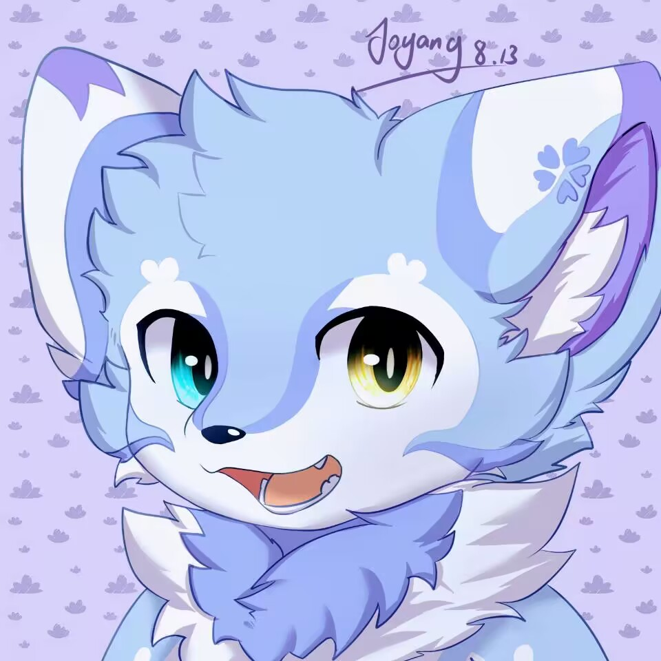
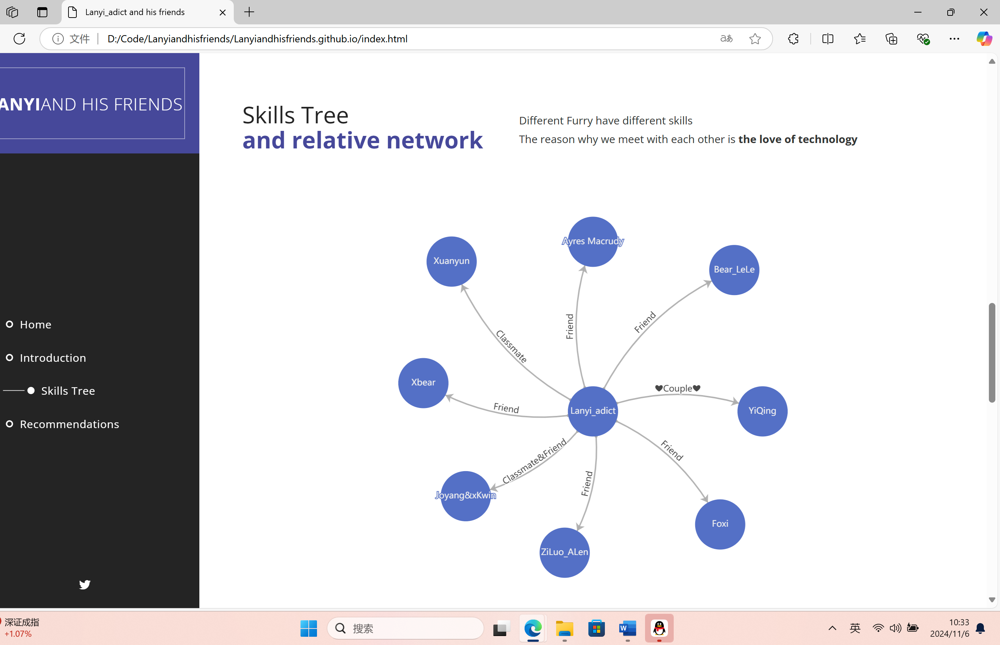

# Lanyi_adict and his friends Web
## Introduction 
This is my first attempt at a website project. This site will introduce my friends in the furry field, most of whom are college students in the field of science and engineering, covering computer science, mechanical engineering, microelectronics, applied statistics, and many more. Some members have their own websites that aggregate their personal learning materials, which also link to this site, which uses **HTML5**, **CSS** and **Javascript** for page image scrolling Membership diagrams and skill trees are implemented using Echarts technology.
<br>
**Lanyi_adict**<br>
A furry major in **Computer Science**, a blue fox spend a lot of time on code every day. He want to apply for a master and Phd's degree in **Cybersecurity** or **Robotics** in the USA. <br>
**Skill:** C/C++, Java, Python, HTML, CSS, JavaScript, SQL, Kali Linux.

## Relationship map and skill tree

This graph is drawn using the Echarts technique.

```javascript
tooltip: {
                  show: true,
                  formatter: function (params) {
                    if (params.data) {
                    return `<b>Major: ${params.data.Major}</b><br>  Skills: ${params.data.skills}`;
                    }

                  }
}
```
The formatter function is used to customize the display of a tooltip. When a user hovers over a data node on the chart, a tooltip displays the details of the data.

```javascript
{ name: 'the name of the member', 
                      x: The position of the x-axis, 
                      y: The position of the y-axis,
                      skills:'The skills that the mamber have',
		            Major:'the major of the mamber',
                  },
```
This is the code for the Ecahrts code to build each node of the image
```javascript
{
                        source: 'name',
                        target: 'target's name',
                        label: {
                          show: true,
                          formatter: '' //The label content is displayed on the wire to identify the relationship between the two nodes
                        },
                        lineStyle: { curveness: defines the style of the wire }
                      },
```
This code snippet is used to define the style and label of the line (edge) between two nodes in the diagram.

## Continue development
I will continue to develop the front-end and back-end of the site, and I will work with my friends and everyone I want to see (smile) to improve and learn together

## Warning
There are still some bugs in this website, which means that I have to fix it in the future.
